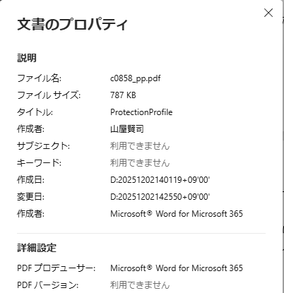
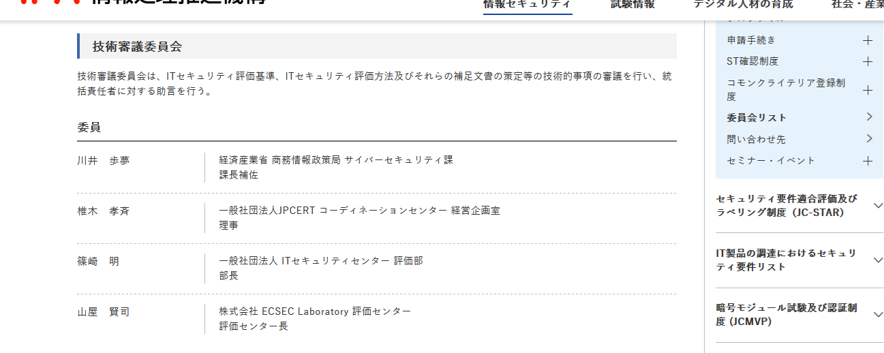

# Introduction
[JISEC-C0858](https://www.ipa.go.jp/security/jisec/pps/certified-pps/omgdg50000001z2c-att/c0858_pp.pdf) was developed by [Japan Agency for Local Authority Information Systems (J-LIS)](https://www.j-lis.go.jp/), evaluated by [ECSEC Laboratory](https://www.ecsec.jp/publics/index/29/), an Evaluation Facility in Japan, and certified by [JISEC](https://www.ipa.go.jp/en/security/jisec/index.html), CC Certification Body in Japan.

# Findings
## Member of the Evaluation Facility is credited as the author of the PP.
From the document property of the PP, the name of document writer can be identified:

Here the same name can be identified as one of members of the Evaluation Facility:

This is evidence that impartiality has been compromised.

## Modern use cases are not documented.
Following use cases of Personal Number Cards are not documented:
- Using Personal Number Cards as Driving License cards.
- Integrating Personal Number Card functionality into Smartphone. 

It is regrettable that these important use cases were not addressed, despite the long evaluation period as pointed out later.

Also it is unclear whether sufficient countermeasures are being taken to address the attack scenarios associated with above use cases.

## 12-month of long evaluation period
From its [Certification Report](https://www.ipa.go.jp/security/jisec/pps/certified-pps/omgdg50000001z2c-att/c0858_rpt.pdf), the evaluation of the PP was started from September 2024, and ended in September 2025.
Two observation reports were issued on June and July 2025, which is at least 9 months after the evaluation started.
From this information, we cannot see a sign of a willingness to resolve issues early on. 
It seems evaluators don't even recognize a problem as a problem until someone points it out.

## AES-192 is selected, while NIAP recommends AES-256.
From Table 4-1, AES-192 is seleted for encryption/decryption, and CMAC generation/verification.

On the other hand, NIAP, US Certification Body, released [Commercial National Security Algorithm Suite 2.0](https://media.defense.gov/2022/Sep/07/2003071836/-1/-1/0/CSI_CNSA_2.0_FAQ_.PDF), and AES-256 is included but AES-192 is not included.

Taking into account that J-LIS took more than a decade to revise a [Personal Number Cards Protection Profile](https://www.ipa.go.jp/en/security/jisec/pps/certified-cert/b9ck990000000ygf-att/c0431_epp.pdf), there is concern that the selected cryptographic algorithm may be compromised before new protection profile comes out.

## Misleading use of functional components
### FIA_SOS.2
The functional component FIA_SOS.2 is used to generate a `nonce` based on A.3.1, A.3.2, or A.3.3 of [FIPS 186-5](https://nvlpubs.nist.gov/nistpubs/FIPS/NIST.FIPS.186-5.pdf).
To be more precise, [FIPS 186-5](https://nvlpubs.nist.gov/nistpubs/FIPS/NIST.FIPS.186-5.pdf) does not use the term `nonce` in A.3.1, A.3.2, nor A.3.3.

A.3.1, A.3.2, and A.3.3 of [FIPS 186-5](https://nvlpubs.nist.gov/nistpubs/FIPS/NIST.FIPS.186-5.pdf) generate a `per-message secret`, which will is equally valuable as cryptographic key.

Here FIA family is for Identification and Authentication, while `nonce` or `per-message secret` is not for Identification and Authentication, but for cryptographic security.
Therefore, it is inappropriate to use FIA_SOS.2 for `per-message secret` generation.

### FCS_CKM.2
The functional component FCS_CKM.2 is used to perform ECDH key agreement.
Here, in [E.3.2.2 of CC:2022 Part 2](https://www.commoncriteriaportal.org/files/ccfiles/CC2022PART2R1.pdf#page=195), "cryptographic key agreement" is mentioned as an operation of FCS_COP.1.1.
Based on this description, another functional component FCS_COP.1 should be used instead.

Note here that the description of FCS_CKM.2 before refinement does not explain how to distribute cryptographic keys.
Good refinement example of FCS_CKM.2 can be found in [Cryptographic Modules, Security Level "Low", Version 1.0](https://www.commoncriteriaportal.org/nfs/ccpfiles/files/ppfiles/pp0044b.pdf).

## Obvious typographical errors have been overlooked.
### Note to Table 6-1, FIA_SOS.2.2
We can find two occurrences of `Per-massage secret` within Note to Table 6-1 and FIA_SOS.2.2.

&#x1f486; &#x1f92b;

These are pure typographical errors.
Note here that [FIPS 186-5](https://nvlpubs.nist.gov/nistpubs/FIPS/NIST.FIPS.186-5.pdf) uses the term `Per-message secret`.

### Note to FCS_CKM.6
We can find the followin description in FCS_CKM.6.2:
`For volatile memory, the disposal method for cryptography may include cutting off power to the volatile memory.`

Here, in the main body of FCS_CKM.6.1, `cryptographic key destruction method` is mentioned.

Therefore, `disposal method for cryptography` should be written as `cryptographic key destruction method`.

### Section 7 References
The document ID of CC:2022 Part 5 should be `CCMB-2022-11-005`, however, it is written as `CCMB-2022-11-004`.

